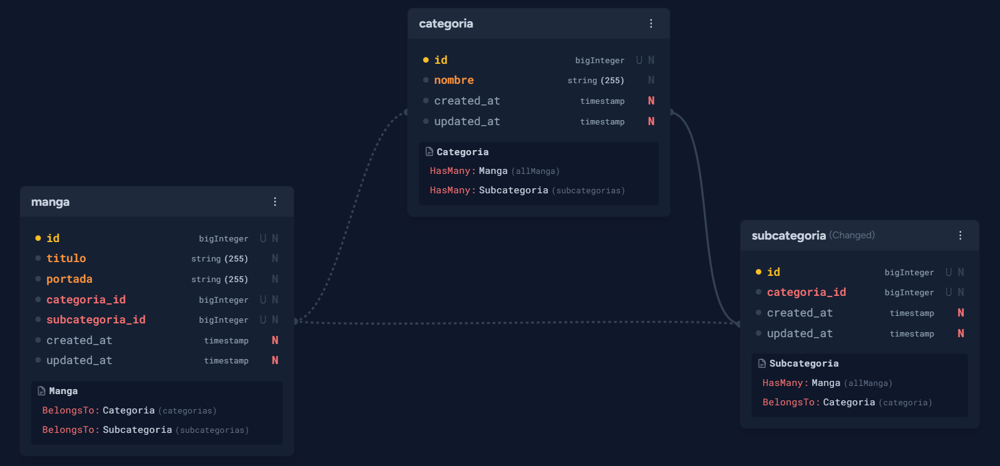
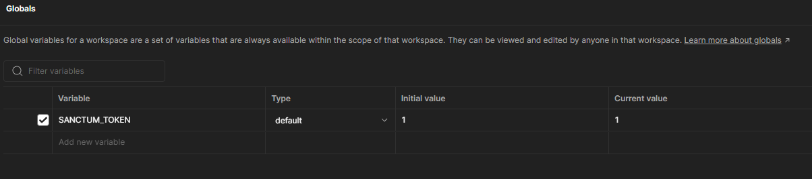
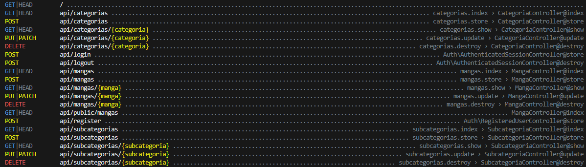

### API REST con Laravel (11)

Desarrollar una API REST para gestionar el inventario de mangas en una tienda. La API debe incluir un CRUD para el manejo de stock.

**Especificaciones de la API**

1. **Áreas de acceso** :

* Zona pública: permite visualizar el listado de mangas disponibles.
* Zona privada: permite la gestión completa de los mangas (creación, actualización y eliminación).

1. **Propiedades de un manga**:

* Título
* Portada
* Categoría
* Subcategoría

1. **Requisitos adicionales** :

* La categoría y subcategoría deben generarse de forma dinámica (una categoría puede contener varias subcategorías).
* Las imágenes de portada deben almacenarse en el sistema de archivos de Laravel (directorio `Storage`).

1. **Documentación y entrega** :

* Subir el proyecto a un repositorio de GitHub.
* Incluir una documentación simplificada con las rutas principales y los puntos clave para su implementación

**Necesario para instalar y utilizar el proyecto:**

1. Clonar el repositorio.
2. cd nombre del repositorio.
3. Composer install.
4. Composer update.
5. Copia el archivo `.env.example` a `.env.`
6. php artisan key:generate.
7. php artisan storage:link.
8. php artisan migrate --seed -> Para crear un usuario con acceso a zona privada, algunas categorias y subcategorias.
9. php artisan serve.
10. http://127.0.0.1:8000 -> A partir de la url dada se puede utilizar los request realizados en POSTMAN.

**Link para los request de postman:** https://www.postman.com/solar-shuttle-781005/workspace/pruebas-publicas/collection/33954971-496fe1f3-1848-47c3-aa82-2b100902c76e?action=share&creator=33954971

**Implementacion del proyecto:**

Consideramos el siguiente diseño:

* Para determinar zona publica y zona privada, utilizamos laravel breeze API, con el sistema de login y register. De manera que los usuarios que no tengan una cuenta solo pueden acceder a la zona publica y el usuario que si tiene cuenta que es unico y es el ADMIN, es autenticado por SANCTUM, con su respectivo Bearer-Token.
* Para el diseño de las tablas y relaciones tomamos en cuenta lo siguiente:
* Categorias:
  * ID (ULID)
  * Nombre
* Subcategorias:
  * ID (ULID)
  * Nombre
  * Categoria_id
* Manga:
  * ID (ULID)
  * Nombre
  * Portada
  * Categoria_id
  * Subcategoria_id

Todas las ID, son de tipo ULID  ya que es una excelente opción para reemplazar los IDs incrementales en Laravel, especialmente cuando se busca una mayor escalabilidad, unicidad y orden en los datos.

Fue pensado de manera que todo manga tiene asociado solo 1 categoria y 1 subcategoria, ademas, a su vez que una categoria puede estar relacionada con 1 o varias subcategorias y que una subcategoria pertecene solo a 1 manga.

Pero tambien sabemos, que en el caso de que no sea como en el test planteado, es decir que un manga tenga mas de 1 categoria asociada y subcategorias, el diseño varía y podria implicar una tabla pivote para esto. En este caso, otra manera de diseñar la BD para considerar categorias y subcategorias, es solo tener 1 tabla de categorias y añadirle un atributo llamado "parent_id" haciendo referencia a otra categoria pero correspondiente a la misma tabla, "un tipo de relacion  llamada recursiva".

**Diagrama para este TEST:**

El test solo menciona el CRUD de los mangas, pero decidimos sumarle CRUD a las categorias y subcategorias, los cuales se pueden observar en los request del POSTMAN.

**Rutas principales:**

No auth:

* url/api/public/mangas ->url = http://127.0.0.1:8000 -> Para obtener todos los mangas sin iniciar sesion (GET)

Auth: Para acceder a la zona privada puede utilizar el siguiente usuario al momento de realizar login en la carpeta Auth de Postman

* email:test@example.com
* password: password -> Una vez iniciado sesion obtendra como respuesta el token para acceder, este debe ser colocado en POSTMAN-> ENVIROMENTS -> GLOBALS -> SANCTUM_TOKEN initial value y current value.

  
* Manga:

  * url/api/mangas -> Para obtener todos los mangas autenticado (GET)
  * url/api/mangas -> (POST) Para crear un manga con sus respectivos atributos anteriormente mencionados.
  * url/api/mangas/{id_manga} -> (GET) Para observar la informacion de 1 manga en particular
  * url/api/mangas/{id_manga} -> (POST) y en el body con _method: "put o patch"
  * url/api/mangas/{id_manga} -> (DELETE) Para eliminar un manga en particular
* Categoria y subcategoria, idem anterior, pero con el modelo correspondiente.

